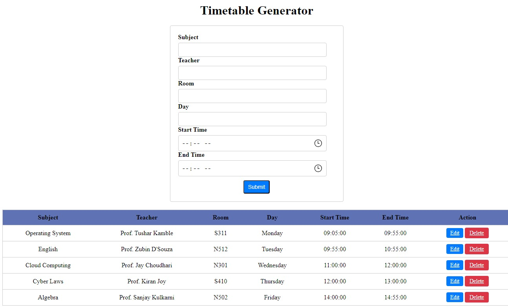
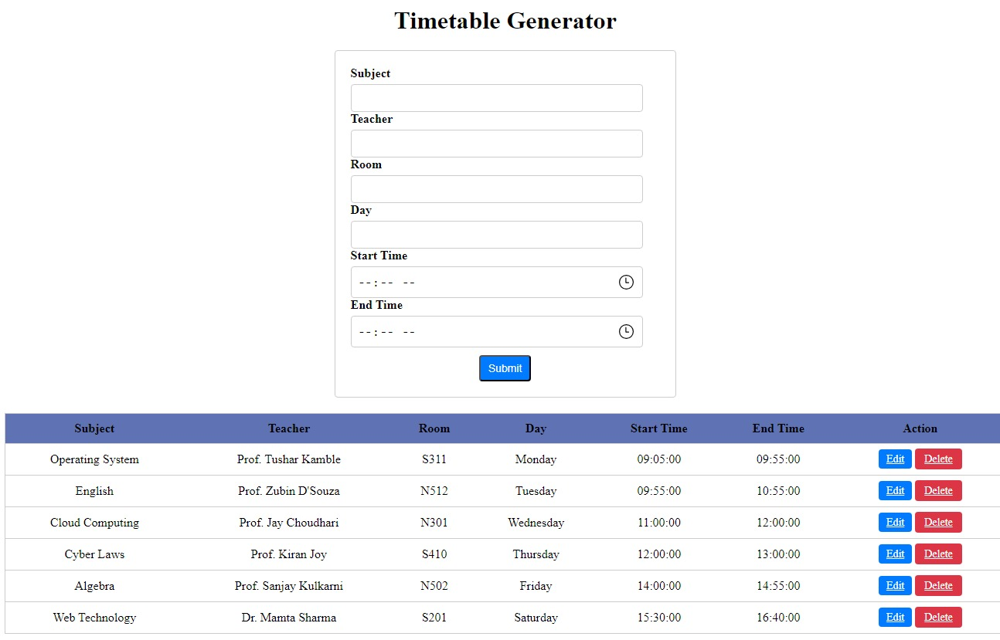
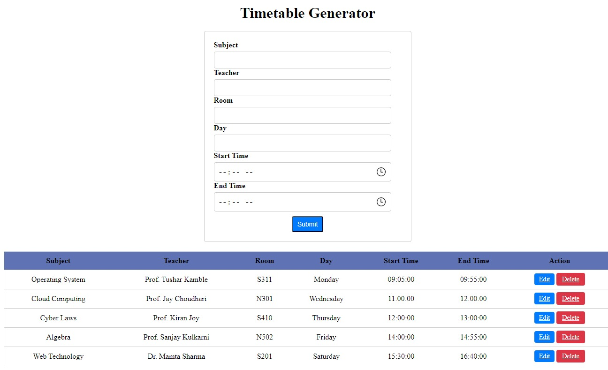

<h1>Basic Layout</h1> 

</img>

<h2>Add user input - 1</h2> 
</img>

<h2>Created first entry in table</h2> 
</img>

<h2>Updating user input -1 with a Cancel button beside </h2> 
</img>
</img>

<h2>Updated user input -1</h2> 
</img>

<h2>Created second entry in table</h2> 
</img>
</img>

<h2>Created five entries in table</h2> 
</img>
</img>

<h2>Deleted second entry from table</h2> 
</img>

<H3>Instructions</H1>
 <h2>Step 1: Set Up XAMPP:</h2>
    <ol>
        <li>Download and install XAMPP from <a href="https://www.apachefriends.org/index.html" target="_blank">https://www.apachefriends.org/index.html</a>.</li>
        <li>Start XAMPP Control Panel.</li>
        <li>Start the "Apache" and "MySQL" services by clicking the "Start" button next to each service.</li>
    </ol>

  <h2>Step 2: Create Project Structure:</h2>
    <ol>
        <li>Inside the htdocs folder of your XAMPP installation directory, create a new folder named timetable_project.</li>
       
   </ol>

<h2>Step 3: Set Up the Database:</h2>
    <ol>
        <li>Open a web browser and navigate to <a href="http://localhost/phpmyadmin/" target="_blank">http://localhost/phpmyadmin/</a>.</li>
        <li>Create a new database named timetable.</li>
        <li>COPY THE CODE Given inside this project file name - MySQL.txt , run the code in order to create the table.</li>
    
  </ol>

   <h2>Step 4: Create PHP , CSS  Files inside timetable_project folder ( created inside htdocs ):</h2>
    <ol>
        <li>Create PHP files: index.php , copy the code mentioned in index.php file of this project.</li>
        <li>Create a CSS file :  style.css file and copy the CSS code provided in the style.css file .</li>
    </ol>

   

   <h2>Step 5: Access the Project:</h2>
    <ol>
        <li>Open a web browser and navigate to http://localhost/timetable_project/ .</li>
        <li>Fill in the details and press SUBMIT".</li>
        <li>Generated timetable data will be stored in the database.</li>
       
  </ol>

  
Note: Ensure correct MySQL credentials, and verify MySQL and Apache services are running in XAMPP. Customize and enhance the Timetable based on your requirements.

